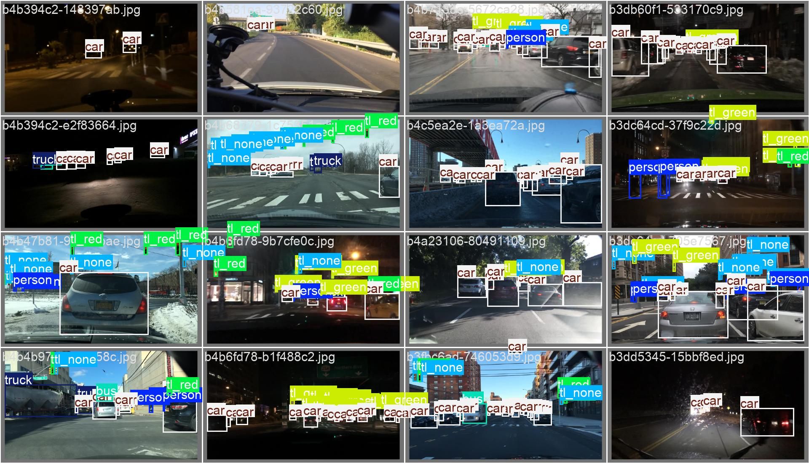
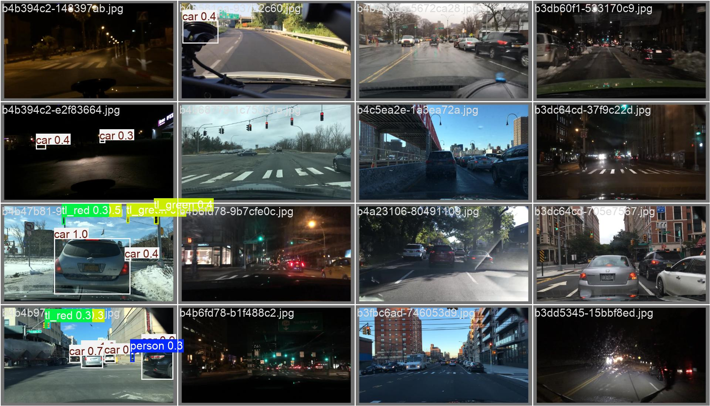

# YOLO-DLT

## First benchmark with pretrained YoloV11n on BDD1k for 1 epoch

**Quantitative Results**
| Epoch | Time | Train Box Loss | Train Cls Loss | Train DFL Loss | Precision (B) | Recall (B) | mAP50 (B) | mAP50-95 (B) | Val Box Loss | Val Cls Loss | Val DFL Loss | LR PG0 | LR PG1 | LR PG2 |
|-------|--------|---------------|---------------|---------------|--------------|------------|----------|------------|-------------|-------------|-------------|-------------|-------------|-------------|
| 1 | 1496.64 | 1.60964 | 1.98649 | 1.10344 | 0.35949 | 0.03876 | 0.03721 | 0.01961 | 1.43133 | 1.2123 | 1.00766 | 0.000195686 | 0.000195686 | 0.000195686 |

**Qualitative results**

    

        
        
Fig 1: Ground truth labels

    

    

        
        
Fig 2: Predictions

    

